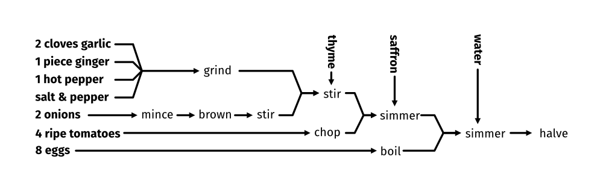
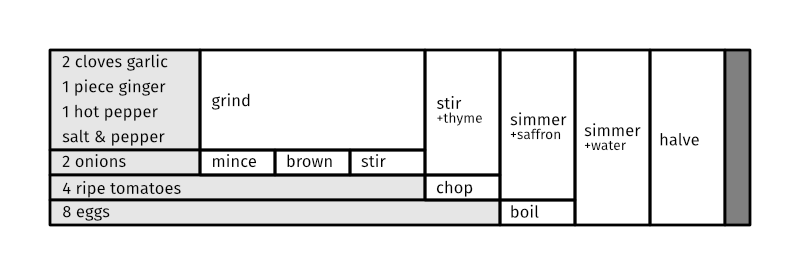

# Apicius

For more detail on this WIP project, consult [this blog post talking
about
it](https://journal.librarianofalexandria.com/backburner-month-07-apicius).

Explorations in recipe visualization. Right now, this just implements
a DSL for describing recipes in a graph-like way. A basic Apicius recipe
looks like this:

```
scrambled eggs {
  [2] eggs -> whisk -> stir & butter -> <>;
}
```

The name of the recipe is `scrambled eggs` and it consists of one
rule.  This rule starts with an ingredient where the amount of the
ingredient is marked with `[...]`, and then has a sequence of
actions. Actions can optionally include ingredients after a `&`
character, which is supposed to be used for garnishes, seasonings, or
incidental ingredients like flour used as a thickener or oil used as a
medium for cooking. Also, `<>` is a special symbol which means "the
end of the recipe".

A recipe can include multiple rules, and you join them together using
_join points_, which are written with a dollar sign:

```
nicer scrambled eggs {
  [1/2] onion + [1 clove] garlic
    -> chop coarsely -> sautee & butter -> $mix;
  [2] eggs -> whisk -> $mix;
  $mix -> stir & salt -> <>;
}
```

This recipe includes a join point called `$mix`, which combines two
previously separate threads of preparation. Rules can begin with
either ingredients or join points, and actions can be either textual
descriptions of what to do or join points. You can also include a join
point as part of a longer chain, so the above recipe could also be
written as

```
nicer scrambled eggs v2 {
  [1/2] onion + [1 clove] garlic
    -> chop coarsely -> sautee & butter -> $mix -> stir & salt -> <>;
  [2] eggs -> whisk -> $mix;
}
```

So the handwavey grammar of recipe descriptions is

```
recipe      ::= text '{' rule* '}'
rule        ::= ( ingredients | join ) '->' action ('->' action) * ';'
ingredients ::= ingredient ('+' ingredient)
ingredient  ::= ( '[' text ']' )? text
action      ::= join | text ('&' ingredients)? | '<>'
```

Eventually, the plan is to implement visualizations. Planned examples
include a graph display like this:



And also a table-based display like this:




## Plan

- [X] Implement basic Apicius parser
- [X] Implement recipe verification and analysis
- [ ] Implement graph display
- [X] Implement chart display
